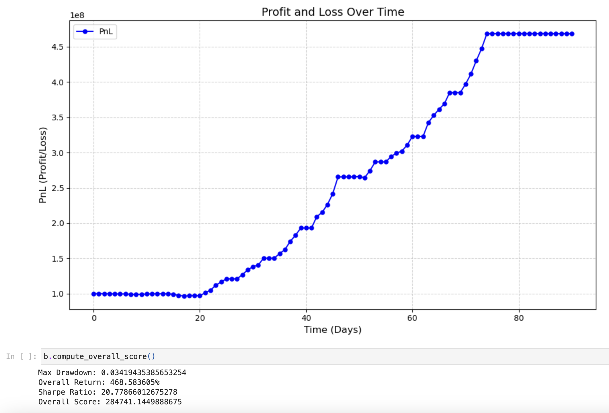

# 🔧 CTCAlgo — Options Trading Backtester

This project was developed for the **2024 Cornell Trading Competition**. It contains a modular Python backtesting framework focused on options trading, with a custom strategy built on volatility signals, delta-neutral positioning, and multi-leg options setups.

---

## 📁 Project Structure

- **`OurStrategy.py`**  
  Implements the core trading strategy logic. It dynamically generates long straddle positions when volatility conditions are met and exits based on time-to-expiry and profit-taking logic.

- **`backtester.py`**  
  The main engine that handles:
  - Trade execution simulation
  - PnL and drawdown calculations
  - Strategy plug-in architecture

- **`run_backtester.ipynb`**  
  Jupyter notebook for interactive testing, visualization, and parameter tuning.

- **`run_backtester.html`**  
  Rendered HTML version of the notebook — open this in your browser to view results without needing Python or Jupyter.

---

## 📈 Strategy Overview

Our strategy focuses on:
- 📉 Buying straddles when implied volatility is low relative to recent historical levels.
- 🧠 Holding positions for a fixed period or until a favorable price move occurs.
- 📊 Tracking key metrics like cumulative return, win/loss ratio, and maximum drawdown.

---

## Backtest Results

| Metric            | Value                 |
|-------------------|-----------------------|
| Overall Return    | **+468.58%**          |
| PnL Multiplier    | **5.69×**             |
| Max Drawdown      | **3.41%**             |
| Sharpe Ratio      | **20.78**             |
| Overall Score     | **284,741.14**        |

These results were obtained from running the strategy on simulated option price data over ~90 days.

